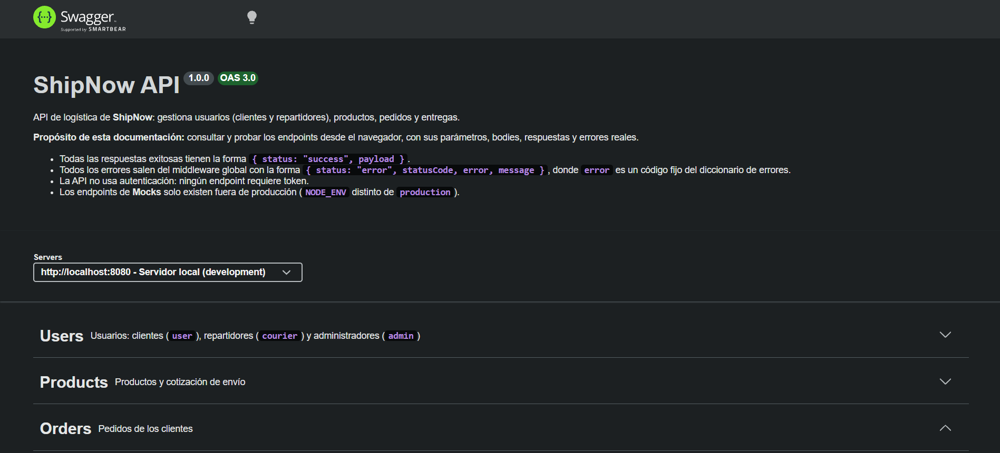
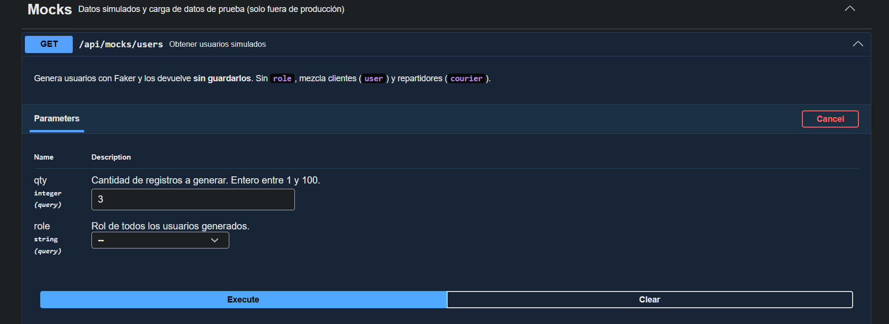
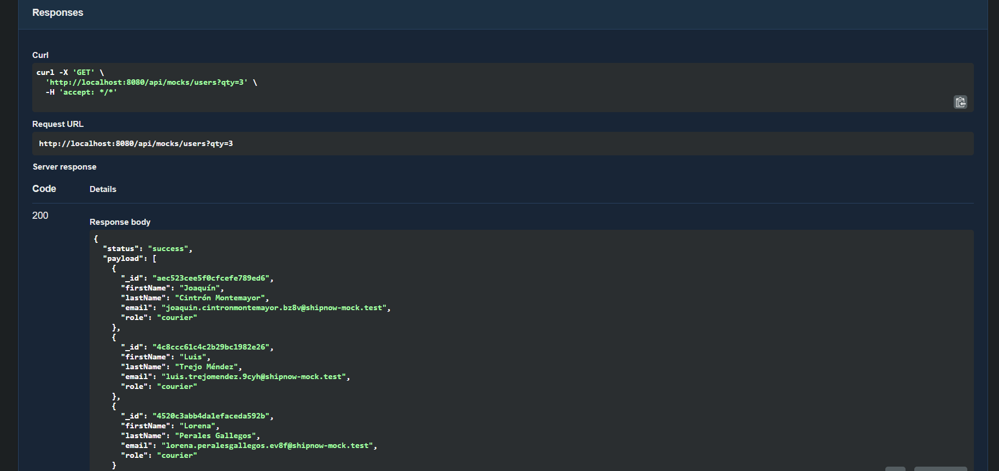
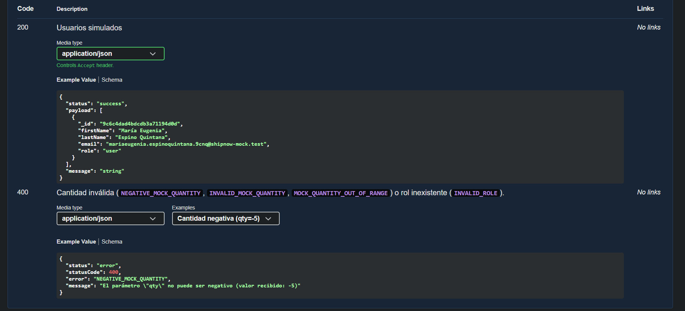

# ShipNow API

API de ShipNow con Node.js, Express y MongoDB, organizada en una arquitectura por capas (Controller → Service → Repository), con un módulo de mocking para generar y cargar datos de prueba, un manejo de errores centralizado, logging profesional con Winston y documentación interactiva con Swagger en **`/api/docs`**.

## Requisitos

- Node.js 18 o superior
- MongoDB (local o Atlas)

## Cómo correr el proyecto

1. Instalar las dependencias:

   ```bash
   npm install
   ```

2. Crear el archivo `.env` a partir del ejemplo y completar los valores:

   ```bash
   cp .env.example .env
   ```

   | Variable | Descripción | Ejemplo |
   | --- | --- | --- |
   | `PORT` | Puerto del servidor | `8080` |
   | `MONGODB_URI` | Cadena de conexión a MongoDB | `mongodb://localhost:27017/shipnow` |
   | `NODE_ENV` | Entorno: `development`, `production` o `test` | `development` |
   | `SHIPPING_API_KEY` | API key del servicio de envíos | `una_clave` |

3. Levantar el servidor:

   ```bash
   npm run dev   # desarrollo, con nodemon
   npm start     # producción
   ```

Si falta alguna variable obligatoria (por ejemplo `MONGODB_URI`), la app no arranca y muestra cuál falta:

```
Error: Configuración inválida: faltan las variables de entorno MONGODB_URI. Revisá tu archivo .env (podés copiar .env.example como base).
```

## Estructura

```
src/
├── config/
│   ├── env.config.js      # Único lugar que lee process.env; valida las variables al arrancar
│   ├── logger.js          # Logger centralizado (Winston): niveles, formato, consola, archivos y rotación
│   ├── swagger.js         # Configuración de Swagger/OpenAPI y montaje de /api/docs
│   └── db.js              # Conexión a MongoDB
├── constants/
│   └── index.js           # Roles, estados, prioridades, tarifas, parámetros de mocks y status HTTP (Object.freeze)
├── models/                # Schemas de Mongoose: User, Product, Order y Delivery
├── mocks/                 # Generadores de datos falsos con Faker (forma de cada modelo)
├── repositories/          # Único lugar que usa los modelos de Mongoose
├── services/              # Reglas de negocio
├── controllers/           # Entrada HTTP: lee req, llama al service, arma res
├── routes/                # Conectan cada path con su método del controller
├── docs/                  # Documentación OpenAPI en YAML, un archivo por módulo + components.yaml (schemas)
├── errors/
│   ├── errorDictionary.js # Diccionario: código → status HTTP y mensaje
│   └── customErrors.js    # AppError y los errores del dominio (UserNotFoundError, etc.)
├── middlewares/
│   ├── errorHandler.js    # Middleware global: única salida de las respuestas de error (y las registra en el log)
│   └── httpLogger.js      # Registra cada petición HTTP con su status y duración
├── utils/
│   └── emailProvider.js   # Proveedor de email simulado
├── app.js                 # Arma la app de Express
└── server.js              # Valida la config, conecta la base y levanta el servidor

logs/                      # Archivos de log generados (ignorados en Git, salvo .gitkeep)
```

## Endpoints

| Método | Ruta | Descripción |
| --- | --- | --- |
| GET | `/api/health` | Health check |
| GET | `/api/users` | Listar usuarios |
| POST | `/api/users` | Crear usuario |
| GET / PUT / DELETE | `/api/users/:id` | Obtener / actualizar / eliminar usuario |
| GET | `/api/products` | Listar productos con stock (`?all=true` incluye los que no tienen) |
| POST | `/api/products` | Crear producto |
| GET / PUT / DELETE | `/api/products/:id` | Obtener / actualizar / eliminar producto |
| GET | `/api/products/:id/shipping-cost` | Cotizar el envío de un producto |
| GET | `/api/orders` | Listar pedidos (con los datos públicos del usuario) |
| POST | `/api/orders` | Crear pedido (`user`, `items`, `deliveryAddress`, `priority` opcional) |
| GET | `/api/orders/:id` | Obtener un pedido |
| PATCH | `/api/orders/:id/status` | Cambiar el estado de un pedido (`{ "status": "assigned" }`) |
| GET | `/api/deliveries` | Listar entregas (con los datos públicos del pedido y del repartidor) |
| POST | `/api/deliveries` | Crear la entrega de un pedido (`order`, `courier` y `estimatedDate` opcionales) |
| GET | `/api/deliveries/:id` | Obtener una entrega |
| PATCH | `/api/deliveries/:id/status` | Cambiar el estado de una entrega (`{ "status": "in_transit" }`) |
| PATCH | `/api/deliveries/:id/courier` | Asignar repartidor a una entrega (`{ "courier": "ID" }`) |
| — | `/api/mocks/...` | Datos simulados y carga de datos de prueba (ver abajo) |
| GET | `/api/docs` | Documentación interactiva (Swagger UI). El JSON de la especificación está en `/api/docs.json` |
| GET | `/api/loggerTest` | Herramienta interna: genera un log de cada nivel (ver [Logging](#logging-y-monitoreo)) |

Las respuestas exitosas tienen la forma `{ "status": "success", "payload": ... }`. Las de error se explican en [Manejo de errores](#manejo-de-errores).

## Por qué separé la lógica entre Service y Repository

El criterio fue preguntarme, para cada línea, si cambiaría porque cambia **el negocio** o porque cambia **la base de datos**.

**En el Service quedaron las reglas de ShipNow**, que existirían igual aunque los datos estuvieran en otra base:

- El estado de un producto depende del stock (`stock > 0` → `available`, si no → `out_of_stock`).
- El catálogo público muestra solo productos disponibles, salvo que se pida `?all=true`.
- El costo de envío: tarifa plana de $10 en desarrollo, y $50 + 1% del valor declarado en producción.
- No se pueden crear ni ascender administradores desde la API pública.
- No puede haber dos productos con el mismo código ni dos usuarios con el mismo email.
- Avisar por email cuando se crea un producto.

**En el Repository quedó todo lo que depende de Mongoose**, y nada más:

- Las consultas y sus filtros (`findAvailable` filtra en la base con `{ stock: { $gt: 0 }, status: 'available' }` en lugar de traer todo y filtrar en memoria).
- Las proyecciones: el repositorio de usuarios nunca devuelve el campo `password`, y ninguno devuelve `__v`.
- Como resguardo, no consultar con un ID que no tenga formato de ObjectId (devuelve `null` en lugar de provocar un `CastError`). La validación principal del formato se hace antes, en la ruta (`router.param`) y en los services, y responde `400 INVALID_ID`.
- Devolver objetos planos (`.lean()`) en lugar de documentos de Mongoose, para que las demás capas no dependan de Mongoose.

Así, el Repository no es un "pasamanos" que solo hace `return Model.find()`, pero tampoco decide reglas: por ejemplo, ofrece `findAll()` y `findAvailable()`, y es el Service el que decide cuál usar.

Además, los Services reciben sus dependencias por el constructor (repositorio, proveedor de email y configuración). Eso permite probarlos más adelante con mocks, sin base de datos.

## Módulo de mocking (`/api/mocks`)

Genera usuarios, repartidores, pedidos y entregas de prueba con [Faker](https://fakerjs.dev/), sin cargar datos a mano. Los datos tienen la misma forma que los modelos reales y usan las constantes de `src/constants/index.js` para roles, estados y prioridades.

> Las rutas de mocks **solo existen fuera de producción**. Con `NODE_ENV=production`, `/api/mocks` responde 404.

### Endpoints

**Datos simulados (no se guardan en la base):**

| Método | Ruta | Parámetros | Qué devuelve |
| --- | --- | --- | --- |
| GET | `/api/mocks/users` | `qty`, `role` (opcional) | Usuarios. Sin `role`, mezcla clientes (`user`) y repartidores (`courier`) |
| GET | `/api/mocks/couriers` | `qty` | Repartidores (rol `courier`) |
| GET | `/api/mocks/orders` | `qty` | Pedidos con items, dirección de entrega, total, estado y prioridad |
| GET | `/api/mocks/deliveries` | `qty` | Entregas, cada una asociada a un pedido |
| GET | `/api/mocks/scenario` | `users`, `couriers`, `orders` | Un escenario completo y relacionado: clientes, repartidores, pedidos y entregas |

**Carga de datos de prueba (se guardan en MongoDB):**

| Método | Ruta | Parámetros | Qué hace |
| --- | --- | --- | --- |
| POST | `/api/mocks/seed` | `qty`, `role` (opcional) | Inserta `qty` usuarios |
| POST | `/api/mocks/seed/scenario` | `users`, `couriers`, `orders` | Inserta un escenario relacionado en `users`, `orders` y `deliveries` |
| DELETE | `/api/mocks/seed` | — | Borra **solo** los datos generados por los mocks |

- `qty`: entero entre 1 y 100 (por defecto 5).
- `role`: `admin`, `user` o `courier`.
- `scenario`: por defecto `users=5`, `couriers=2`, `orders=10`. `couriers` y `orders` pueden ser 0.
- En los dos `POST` de carga, los parámetros también pueden enviarse en el body como JSON (por ejemplo `{ "qty": 10 }` o `{ "users": 5, "couriers": 2, "orders": 10 }`). Si un valor está en el body y en la query, se usa el del body.
- Un valor inválido, negativo o fuera de rango, o un rol inexistente, responde `400` con el formato de error estándar (ver [Manejo de errores](#manejo-de-errores)).

### Ejemplos

`GET /api/mocks/users?qty=2`

```json
{
  "status": "success",
  "payload": [
    { "_id": "9c6c4dad4bdcdb3a71194d0d", "firstName": "María Eugenia", "lastName": "Espino Quintana", "email": "mariaeugenia.espinoquintana.9cnq@shipnow-mock.test", "role": "user" },
    { "_id": "f8c3fea8f27aa6fb046ddee0", "firstName": "Luisa", "lastName": "Ballesteros Tamayo", "email": "luisa.ballesterostamayo.b6gg@shipnow-mock.test", "role": "courier" }
  ]
}
```

`POST /api/mocks/seed?qty=10`

```json
{ "status": "success", "payload": { "inserted": 10, "collection": "users" } }
```

`POST /api/mocks/seed/scenario?users=5&couriers=2&orders=10`

```json
{
  "status": "success",
  "payload": {
    "inserted": { "users": 7, "orders": 10, "deliveries": 10 },
    "detail": { "clients": 5, "couriers": 2 }
  }
}
```

`DELETE /api/mocks/seed`

```json
{ "status": "success", "payload": { "deleted": { "users": 7, "orders": 10, "deliveries": 10 } } }
```

### Cómo probarlo

1. Levantar el servidor con `npm run dev` (`NODE_ENV=development`).
2. Desde Postman o el navegador, pedir datos simulados: `GET http://localhost:8080/api/mocks/scenario?users=2&couriers=1&orders=4`.
3. Cargar datos en la base: `POST http://localhost:8080/api/mocks/seed/scenario`.
4. Revisarlos en MongoDB Atlas (*Browse Collections*): las colecciones `users`, `orders` y `deliveries` tienen los registros nuevos, y `GET /api/users` lista los usuarios cargados.
5. Al terminar, limpiar con `DELETE http://localhost:8080/api/mocks/seed`.

### Evidencia de pruebas (Postman)

**Datos simulados:** `GET /api/mocks/scenario?users=2&couriers=1&orders=4` devuelve clientes, repartidores, pedidos y entregas relacionados, sin guardarlos.


**Carga en MongoDB:** `POST /api/mocks/seed/scenario` inserta 7 usuarios (5 clientes y 2 repartidores), 10 pedidos y 10 entregas, y responde `201 Created`.


**Limpieza:** `DELETE /api/mocks/seed` borra exactamente los registros que había cargado el seed.


### Relaciones y reglas que respetan los datos

- **Pedido ↔ usuario:** cada pedido pertenece a un usuario con rol `user` (cliente).
- **Entrega ↔ pedido:** cada pedido tiene exactamente una entrega (`order` es único en `deliveries`).
- **Entrega ↔ repartidor:** la entrega lleva repartidor solo si el estado del pedido lo requiere, y ese repartidor siempre tiene rol `courier`:

| Estado del pedido | Estado de la entrega | ¿Repartidor? |
| --- | --- | --- |
| `created` | `pending` | No |
| `assigned` | `assigned` | Sí |
| `picked_up` | `in_transit` | Sí |
| `in_transit` | `in_transit` | Sí |
| `delivered` | `delivered` (con `deliveredAt`) | Sí |
| `cancelled` | `cancelled` | No |

- Si se piden 0 repartidores, los pedidos solo pueden quedar `created` o `cancelled`.
- El `total` del pedido es la suma de `cantidad × precio unitario` de sus items.
- Los usuarios generados nunca son administradores, salvo que se pida `role=admin` explícitamente.
- La contraseña nunca se devuelve en las respuestas.

### Cómo se reparte en las capas

- `mocks/`: generadores que solo arman objetos con la forma de cada modelo (nombres, emails, direcciones, items). No deciden roles, estados ni relaciones.
- `services/mocks.service.js`: las reglas. Valida los parámetros, elige roles y estados, arma las relaciones entre pedidos, entregas y repartidores, y calcula el total de cada pedido.
- `repositories/`: la inserción masiva (`insertMany`) y el borrado de los datos de prueba. Son los únicos que tocan Mongoose.
- `controllers/mocks.controller.js` y `routes/mocks.router.js`: solo HTTP; la ruta conecta el path con el método del controller.

Los datos de prueba se identifican por el dominio de email `shipnow-mock.test` (un dominio reservado que no existe). Así `DELETE /api/mocks/seed` borra únicamente lo que generaron los mocks, sin tocar los datos cargados a mano.

## Manejo de errores

Todos los errores de la API salen de un único lugar, el middleware global `src/middlewares/errorHandler.js`, y siempre con la misma estructura.

### Estructura de la respuesta de error

```json
{
  "status": "error",
  "statusCode": 404,
  "error": "USER_NOT_FOUND",
  "message": "El usuario solicitado no existe"
}
```

| Campo | Qué es |
| --- | --- |
| `status` | Siempre `"error"` |
| `statusCode` | El mismo código HTTP de la respuesta |
| `error` | Código fijo del diccionario, pensado para que lo lea el frontend (`if (data.error === "USER_NOT_FOUND")`) |
| `message` | Explicación para personas. Puede incluir el detalle del caso (qué parámetro falló, qué valores se permiten) |

### Cómo está organizado

1. **Diccionario (`src/errors/errorDictionary.js`):** cada error conocido tiene un código, un status HTTP y un mensaje por defecto. Es la única fuente de esos valores.
2. **Errores personalizados (`src/errors/customErrors.js`):** `AppError` extiende `Error` y toma status y mensaje del diccionario. Cada caso del dominio tiene su clase: `UserNotFoundError`, `OrderNotFoundError`, `InvalidOrderStatusError`, `NegativeMockQuantityError`, `MockSeedFailedError`, etc.
3. **Detección en los services:** los services detectan el problema y **lanzan** el error (`throw new OrderNotFoundError()`). No conocen Express ni arman respuestas.
4. **Controllers:** no responden errores; solo los derivan con `next(error)`.
5. **Middleware global:** convierte cualquier error en la respuesta uniforme. Además traduce errores que no son nuestros:

| Origen | Código |
| --- | --- |
| Body con JSON mal formado | `INVALID_JSON` (400) |
| Validación del schema de Mongoose | `VALIDATION_ERROR` (400) |
| Clave duplicada en MongoDB | `DUPLICATE_KEY` (409) |
| Sin conexión con MongoDB | `DATABASE_UNAVAILABLE` (503) |
| Ruta inexistente | `ROUTE_NOT_FOUND` (404) |
| Cualquier error no previsto (un bug) | `INTERNAL_ERROR` (500), con mensaje genérico |

En los errores 500 el detalle técnico (stack, mensaje original) va **solo al log del servidor**; al cliente nunca le llegan rutas internas ni datos de conexión. Todos los errores quedan registrados con el logger: los 4xx como `warning` y los 5xx como `error`, con su stack (ver [Logging](#logging-y-monitoreo)).

### Diccionario de errores

| Código | Status | Cuándo ocurre |
| --- | --- | --- |
| `VALIDATION_ERROR` | 400 | Faltan datos obligatorios o tienen formato incorrecto |
| `INVALID_JSON` | 400 | El body no es un JSON válido |
| `INVALID_ID` | 400 | Un ID con formato inválido, en la ruta (`/api/orders/abc`) o en el body (`user`, `order`, `courier`) |
| `ROUTE_NOT_FOUND` | 404 | La ruta no existe |
| `DUPLICATE_KEY` | 409 | Un campo único ya existe en la base |
| `DATABASE_UNAVAILABLE` | 503 | La base de datos no responde |
| `INTERNAL_ERROR` | 500 | Error inesperado |
| `USER_NOT_FOUND` | 404 | El usuario no existe (también al crear un pedido para un usuario inexistente) |
| `EMAIL_ALREADY_REGISTERED` | 409 | El email ya está registrado |
| `INVALID_ROLE` | 400 | Rol inexistente |
| `ADMIN_ROLE_NOT_ALLOWED` | 403 | Intento de crear o ascender un administrador |
| `PRODUCT_NOT_FOUND` | 404 | El producto no existe |
| `PRODUCT_CODE_ALREADY_EXISTS` | 409 | Ya hay un producto con ese código |
| `INVALID_PRODUCT_STATUS` | 400 | Estado de producto inexistente |
| `INVALID_PRICE` | 400 | Precio negativo o no numérico |
| `SHIPPING_CONFIG_INVALID` | 500 | Falta la configuración del servicio de envíos |
| `ORDER_NOT_FOUND` | 404 | El pedido no existe |
| `INVALID_ORDER_STATUS` | 400 | Estado de pedido inexistente (por ejemplo `on_the_way`) |
| `INVALID_ORDER_PRIORITY` | 400 | Prioridad inexistente |
| `ORDER_OWNER_NOT_CLIENT` | 400 | Se intenta crear un pedido para un repartidor o un admin |
| `ORDER_STATUS_LOCKED` | 409 | Se intenta cambiar el estado de un pedido entregado o cancelado |
| `DELIVERY_NOT_FOUND` | 404 | La entrega no existe |
| `DELIVERY_ALREADY_EXISTS` | 409 | El pedido ya tiene una entrega |
| `INVALID_DELIVERY_STATUS` | 400 | Estado de entrega inexistente |
| `USER_NOT_COURIER` | 400 | Se intenta asignar como repartidor a un usuario que no tiene rol `courier` |
| `DELIVERY_COURIER_REQUIRED` | 409 | Se intenta pasar a `assigned`, `in_transit` o `delivered` una entrega sin repartidor |
| `DELIVERY_STATUS_LOCKED` | 409 | Se intenta modificar una entrega `delivered` o `cancelled` |
| `INVALID_MOCK_QUANTITY` | 400 | La cantidad de mocks no es un número entero (`abc`, `2.5`) |
| `NEGATIVE_MOCK_QUANTITY` | 400 | La cantidad de mocks es negativa |
| `MOCK_QUANTITY_OUT_OF_RANGE` | 400 | La cantidad de mocks está fuera del rango (1 a 100; 0 a 100 para `couriers` y `orders` del escenario) |
| `MOCK_SEED_FAILED` | 500 | Falló la carga de datos de prueba en MongoDB |

### Fallas durante la carga de mocks en MongoDB

- **Antes de cargar**, el seed verifica que haya conexión con la base. Si no la hay, responde enseguida `503 DATABASE_UNAVAILABLE`, sin intentar guardar nada.
- **Si la carga falla a mitad de camino** (por ejemplo, se guardaron los usuarios pero fallan los pedidos), el service borra lo que se llegó a guardar y responde `500 MOCK_SEED_FAILED` con el mensaje *"No se guardó ningún registro"*. Esto es posible porque los IDs se generan antes de insertar, así que se sabe exactamente qué borrar.
- Si además la base se cayó y no se pudo deshacer, el mensaje lo avisa y sugiere limpiar con `DELETE /api/mocks/seed`.

### Cómo probar los casos inválidos

Con el servidor levantado (`npm run dev`), desde Postman:

**Módulo de mocks**

| Petición | Respuesta esperada |
| --- | --- |
| `GET /api/mocks/users?qty=-5` | 400 `NEGATIVE_MOCK_QUANTITY` |
| `GET /api/mocks/users?qty=abc` | 400 `INVALID_MOCK_QUANTITY` |
| `GET /api/mocks/users?qty=2.5` | 400 `INVALID_MOCK_QUANTITY` |
| `GET /api/mocks/users?qty=0` | 400 `MOCK_QUANTITY_OUT_OF_RANGE` |
| `GET /api/mocks/users?qty=500` | 400 `MOCK_QUANTITY_OUT_OF_RANGE` |
| `GET /api/mocks/users?role=jefe` | 400 `INVALID_ROLE` |
| `GET /api/mocks/scenario?couriers=-1` | 400 `NEGATIVE_MOCK_QUANTITY` |
| `POST /api/mocks/seed?qty=-3` | 400 `NEGATIVE_MOCK_QUANTITY` |
| `POST /api/mocks/seed` con la base caída | 503 `DATABASE_UNAVAILABLE` |

Para probar la falla de base: con el servidor corriendo, pausá el cluster en Atlas (o cortá internet) y esperá unos segundos a que se pierda la conexión antes de llamar al seed.

**Usuarios y productos**

| Petición | Respuesta esperada |
| --- | --- |
| `GET /api/users/652f1c2b9b1e8a0012345678` | 404 `USER_NOT_FOUND` |
| `POST /api/users` con un email ya registrado | 409 `EMAIL_ALREADY_REGISTERED` |
| `POST /api/users` con `"role": "admin"` | 403 `ADMIN_ROLE_NOT_ALLOWED` |
| `POST /api/users` con `"role": "jefe"` | 400 `INVALID_ROLE` |
| `POST /api/users` con `{ "firstName": "Ana" }` | 400 `VALIDATION_ERROR` |
| `POST /api/users` con un body mal formado (`{mal json`) | 400 `INVALID_JSON` |
| `GET /api/products/652f1c2b9b1e8a0012345678` | 404 `PRODUCT_NOT_FOUND` |
| `GET /api/products/123` (ID con formato inválido) | 400 `INVALID_ID` |
| `POST /api/products` con `"price": -1` | 400 `INVALID_PRICE` |
| `POST /api/products` con un `code` repetido | 409 `PRODUCT_CODE_ALREADY_EXISTS` |

**Pedidos** (los tres casos del material del módulo)

| Petición | Respuesta esperada |
| --- | --- |
| `POST /api/orders` con un `user` que no existe | 404 `USER_NOT_FOUND` |
| `POST /api/orders` con `"user": "abc"` | 400 `INVALID_ID` |
| `GET /api/orders/abc` | 400 `INVALID_ID` |
| `POST /api/orders` sin `items` o sin dirección | 400 `VALIDATION_ERROR` |
| `PATCH /api/orders/:id/status` con `{ "status": "on_the_way" }` | 400 `INVALID_ORDER_STATUS` |
| `GET /api/orders/652f1c2b9b1e8a0012345678` | 404 `ORDER_NOT_FOUND` |
| `POST /api/orders` con el ID de un repartidor como `user` | 400 `ORDER_OWNER_NOT_CLIENT` |
| `PATCH /api/orders/:id/status` sobre un pedido `delivered` | 409 `ORDER_STATUS_LOCKED` |
| `GET /api/nada` | 404 `ROUTE_NOT_FOUND` |

Body de ejemplo para crear un pedido válido (reemplazá `user` por el `_id` de un usuario con rol `user`):

```json
{
  "user": "ID_DE_UN_USUARIO",
  "items": [{ "description": "Caja mediana", "quantity": 2, "unitPrice": 1500 }],
  "deliveryAddress": { "street": "Belgrano 120", "city": "Córdoba", "province": "Córdoba", "zipCode": "5000" },
  "priority": "high"
}
```

El pedido se crea siempre en estado `created` y con el `total` calculado por el service, aunque el body traiga otro `status` o `total`.

## Logging y monitoreo

La API usa **[Winston](https://github.com/winstonjs/winston)** como logger centralizado, con **[winston-daily-rotate-file](https://github.com/winstonjs/winston-daily-rotate-file)** para la rotación de archivos. Toda la configuración está en `src/config/logger.js`, y el resto del proyecto importa ese mismo logger: no queda ningún `console.log` en el código.

### Niveles

| Nivel | Prioridad | Para qué se usa en ShipNow |
| --- | --- | --- |
| `fatal` | 0 | Fallas críticas que impiden funcionar: falta una variable de entorno, no se puede conectar a MongoDB al arrancar, excepciones no capturadas |
| `error` | 1 | Errores inesperados del servidor (respuestas 5xx), fallas al cargar o deshacer mocks |
| `warning` | 2 | Errores esperados o de negocio (respuestas 4xx: pedido inexistente, cantidad de mocks inválida, ruta inexistente), conexión con MongoDB perdida, escenario de mocks sin repartidores |
| `info` | 3 | Hitos: servidor iniciado, conexión a MongoDB, pedido/usuario/producto creado, cambio de estado de un pedido, mocks generados o cargados |
| `http` | 4 | Cada petición HTTP: método, ruta, status y duración (`GET /api/orders 200 - 12.4 ms`) |
| `debug` | 5 | Detalle técnico: configuración del logger, intento de conexión, emails simulados |

Un registro se guarda si su nivel es igual o más grave que el nivel mínimo configurado. Por ejemplo, con nivel `info` se registran `info`, `warning`, `error` y `fatal`.

### Formato

Cada línea tiene fecha y hora, nivel y mensaje. Si hay datos de contexto se agregan en JSON al final, y si es un error se agrega el stack en las líneas siguientes:

```
2026-11-12 00:13:58 [info]    Conexión a MongoDB establecida {"database":"shipnow"}
2026-11-12 00:13:58 [info]    Servidor ShipNow escuchando en el puerto 8080 (entorno: development)
2026-11-12 00:14:00 [info]    Pedido creado correctamente: 6af52ef838316ebdd86d8ce4 {"userId":"6af52ef838316ebdd86d8ce1","total":200,"priority":"normal"}
2026-11-12 00:14:00 [http]    POST /api/orders 201 - 6.4 ms
2026-11-12 00:14:00 [warning] 404 ORDER_NOT_FOUND en GET /api/orders/652f1c2b9b1e8a0012345678: El pedido solicitado no existe
2026-11-12 00:14:00 [warning] 400 NEGATIVE_MOCK_QUANTITY en GET /api/mocks/users?qty=-5: El parámetro "qty" no puede ser negativo (valor recibido: -5)
```

En consola los niveles se muestran con colores; en los archivos, en texto plano.

### Comportamiento según el entorno

El nivel depende de `NODE_ENV`, la variable validada en `src/config/env.config.js` (módulo 1):

| Entorno | Consola y `combined` | Archivo de errores |
| --- | --- | --- |
| `development` | desde `debug` (todo) | `error` y `fatal` |
| `test` | desde `warning` | `error` y `fatal` |
| `production` | desde `info` (sin `debug` ni `http`) | `error` y `fatal` |

Si la configuración es inválida (por ejemplo, falta `MONGODB_URI`), el servidor registra un `fatal` con el motivo, espera a que se escriba en el archivo y se detiene:

```
2026-11-12 00:13:36 [fatal]   El servidor no puede arrancar: Configuración inválida: faltan las variables de entorno MONGODB_URI. Revisá tu archivo .env (podés copiar .env.example como base).
```

### Archivos de logs y rotación

Los archivos se guardan en la carpeta `logs/`, en la raíz del proyecto:

| Archivo | Contenido | Rotación |
| --- | --- | --- |
| `logs/error-AAAA-MM-DD.log` | Solo `error` y `fatal` | Un archivo por día; se conservan 14 días; máximo 20 MB por archivo |
| `logs/combined-AAAA-MM-DD.log` | Todo lo que se registra según el nivel del entorno | Un archivo por día; se conservan 7 días; máximo 20 MB por archivo |

Al cambiar el día se crea un archivo nuevo, y los que superan los días de conservación se borran solos. Los archivos ocultos `.*-audit.json` los usa la librería para saber qué archivos borrar.

### Qué se ignora en Git

```gitignore
logs/*
!logs/.gitkeep
```

Los archivos generados por la aplicación no se suben al repositorio. Solo se versiona `logs/.gitkeep`, para que la carpeta exista en el repo.

### Endpoint de prueba del logger

`GET /api/loggerTest` es una herramienta interna (no es una funcionalidad del negocio). Genera un log de cada nivel, marcados con `[PRUEBA]`, y responde la configuración activa:

```json
{
  "status": "success",
  "payload": {
    "message": "Se registró un log de cada nivel. Revisá la consola y la carpeta logs/",
    "levels": ["fatal", "error", "warning", "info", "http", "debug"],
    "consoleLevel": "debug",
    "files": {
      "errors": "logs/error-AAAA-MM-DD.log (solo error y fatal, se conservan 14 días)",
      "combined": "logs/combined-AAAA-MM-DD.log (nivel debug en adelante, se conservan 7 días)"
    }
  }
}
```

**Cómo probarlo:**

1. Levantar el servidor con `npm run dev`.
2. Llamar a `GET http://localhost:8080/api/loggerTest` (desde Postman o el navegador).
3. En la **consola** aparecen los seis niveles.
4. En `logs/error-<fecha>.log` aparecen **solo** el `error` (con su stack) y el `fatal`.
5. En `logs/combined-<fecha>.log` aparecen los seis.
6. Para ver el cambio por entorno, poner `NODE_ENV=production` en el `.env`, reiniciar y repetir: la respuesta indica `"consoleLevel": "info"` y en la consola ya no aparecen `debug` ni `http`.

### Dónde se registra cada evento

| Evento | Nivel | Dónde |
| --- | --- | --- |
| Servidor iniciado | `info` | `server.js` |
| Configuración inválida / no se pudo conectar a MongoDB al arrancar | `fatal` | `server.js` |
| Excepción o promesa rechazada sin capturar | `fatal` | `server.js` |
| Conexión a MongoDB establecida / restablecida | `info` | `config/db.js` |
| Conexión con MongoDB perdida | `warning` | `config/db.js` |
| Cada petición HTTP | `http` | `middlewares/httpLogger.js` |
| Error esperado (4xx): pedido inexistente, cantidad de mocks inválida, ruta inexistente, etc. | `warning` | `middlewares/errorHandler.js` |
| Error inesperado del servidor (5xx), con stack | `error` | `middlewares/errorHandler.js` |
| Mocks generados / cargados / eliminados | `info` | `services/mocks.service.js` |
| Escenario de mocks sin repartidores | `warning` | `services/mocks.service.js` |
| No se pudo deshacer una carga parcial de mocks | `error` | `services/mocks.service.js` |
| Pedido creado / cambio de estado | `info` | `services/orders.service.js` |
| Entrega creada / cambio de estado / repartidor asignado | `info` | `services/deliveries.service.js` |
| Entrega creada sin repartidor | `warning` | `services/deliveries.service.js` |
| Usuario o producto creado | `info` | `services/users.service.js`, `services/products.service.js` |

## Documentación de la API (Swagger)

La API está documentada con **OpenAPI 3** y se puede consultar y probar desde el navegador con **Swagger UI**.

| Qué | Dónde |
| --- | --- |
| Documentación interactiva | `http://localhost:8080/api/docs` |
| Especificación en JSON | `http://localhost:8080/api/docs.json` |

### Cómo acceder

1. Levantar el servidor: `npm install` y `npm run dev` (con el `.env` configurado, ver [Cómo correr el proyecto](#cómo-correr-el-proyecto)).
2. Abrir `http://localhost:8080/api/docs` en el navegador (si cambiaste `PORT` en el `.env`, usá ese puerto).
3. Elegir un endpoint, tocar **Try it out**, completar los datos y tocar **Execute**. La petición se hace contra tu servidor local y se ve la respuesta real.

### Qué está documentado

La documentación está agrupada por tags. Están documentados **todos** los endpoints de la API (30 operaciones):

| Tag | Endpoints | Qué cubre |
| --- | --- | --- |
| **Users** | 5 | Alta, consulta, edición y baja de clientes y repartidores |
| **Products** | 6 | CRUD de productos y cotización de envío |
| **Orders** | 4 | Crear, listar, consultar y cambiar el estado de pedidos |
| **Deliveries** | 5 | Crear la entrega de un pedido, listar, consultar, cambiar estado y asignar repartidor |
| **Mocks** | 8 | Datos simulados (sin guardar), carga de datos de prueba en MongoDB y limpieza |
| **Logger** | 1 | `GET /api/loggerTest`: herramienta de validación del logger, no es una funcionalidad de negocio |
| **Health** | 1 | Estado del servidor |

Cada endpoint indica método, ruta, descripción, parámetros, body esperado (con ejemplo), respuesta exitosa y los errores que puede devolver, con el código real del diccionario de errores (por ejemplo `ORDER_NOT_FOUND` o `NEGATIVE_MOCK_QUANTITY`).

### Schemas reutilizables

Están definidos en `src/docs/components.yaml` y se ven al final de Swagger UI, en la sección **Schemas**:

- **Respuestas:** `SuccessResponse` y `ErrorResponse`.
- **Entidades:** `User`, `Product`, `Order`, `OrderItem`, `Address`, `Delivery`.
- **Bodies de entrada:** `UserInput`, `UserUpdate`, `ProductInput`, `OrderInput`, `OrderStatusInput`, `DeliveryInput`, `DeliveryStatusInput`, `DeliveryCourierInput`, `MockScenarioInput`.
- **Mocks:** `MockUser`, `MockOrder`, `MockDelivery`.

### Cómo está organizado

- `src/config/swagger.js`: **solo configuración** (información general, servidor local, tags y montaje de Swagger UI). Usa `swagger-jsdoc` y `swagger-ui-express`.
- `src/docs/*.yaml`: la documentación, un archivo por módulo (`users.yaml`, `products.yaml`, `orders.yaml`, `deliveries.yaml`, `mocks.yaml`, `logger.yaml`, `health.yaml`) más `components.yaml` con los schemas, parámetros y respuestas compartidas.
- Los archivos de `routes/` no tienen nada de Swagger: siguen solo conectando cada path con su controller.

### Aclaraciones para probar

- **Sin autenticación:** ningún endpoint requiere token ni login.
- **Orden sugerido para probar el flujo completo:**
  1. `POST /api/users` para crear un cliente (rol `user`) y otro con `"role": "courier"`. Guardar los dos `_id`.
  2. `POST /api/orders` con el `_id` del cliente en `user`.
  3. `POST /api/deliveries` con el `_id` del pedido en `order`.
  4. `PATCH /api/deliveries/{id}/courier` con el `_id` del repartidor.
  5. `PATCH /api/deliveries/{id}/status` con `in_transit` y después `delivered`.
- **Atajo:** `POST /api/mocks/seed/scenario` carga clientes, repartidores, pedidos y entregas ya relacionados, y `GET /api/users`, `/api/orders` y `/api/deliveries` devuelven sus IDs. Al terminar, `DELETE /api/mocks/seed` los borra.
- **IDs:** un ID con formato inválido (por ejemplo `abc`) responde `400 INVALID_ID`; un ID con formato correcto que no existe responde `404` (por ejemplo `USER_NOT_FOUND`). Para probar el 404, usá un ID válido inventado como `652f1c2b9b1e8a0012345678`.
- **Mocks:** los endpoints de `/api/mocks` solo existen con `NODE_ENV` distinto de `production`. En producción siguen apareciendo en la documentación, pero responden `404 ROUTE_NOT_FOUND`.
- **Errores 500 y 503:** cualquier endpoint puede responder `500 INTERNAL_ERROR` ante una falla inesperada, o `503 DATABASE_UNAVAILABLE` si MongoDB no responde.

### Evidencia: Swagger funcionando

**Portada:** nombre, versión, descripción, propósito y servidor local.



**Try it out:** `GET /api/mocks/users` con su descripción y sus parámetros (`qty` y `role`), listo para ejecutar desde el navegador.



**Respuesta real del servidor:** `200` con tres usuarios simulados.



**Respuestas documentadas:** el `200` y el `400`, con los cuatro códigos de error posibles y un ejemplo de cada uno.



### Reglas de las entregas

- Cada pedido puede tener **una sola** entrega.
- Con repartidor, la entrega nace `assigned`; sin repartidor, `pending`.
- El repartidor tiene que ser un usuario con rol `courier`.
- Los estados `assigned`, `in_transit` y `delivered` requieren repartidor.
- Al pasar a `delivered` se completa `deliveredAt`.
- Una entrega `delivered` o `cancelled` ya no se puede modificar.
- El código de seguimiento (`trackingCode`) lo genera la API.
